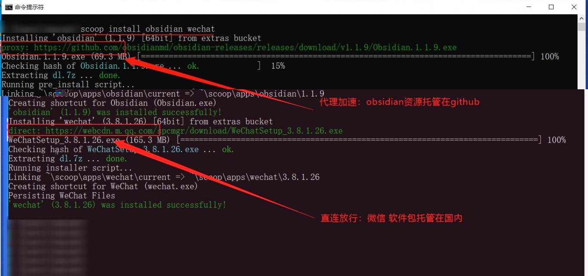

# scoop镜像

## 0. 项目实现功能

国内github访问不通畅，且git、7zip等软件下载慢，导致scoop安装体验极差。该项目为了解决此问题，将scoop主程序库托管在gitee，增加代理逻辑用来分流安装与更新所涉及的资源，提示见附图所示。



**注意事项：**
- 请勿提取并滥用加速链接，如有发现滥用则取消公开；
- **退出360后再使用（如有解决办法可提issue）；**
- 源代码镜像纯属用爱发电，**有用请点star**；

## 1. 安装scoop主程序

### 1.1 初次安装
打开`Windows Powershell`界面（开始菜单右键）
```powershell
# 脚本执行策略更改
Set-ExecutionPolicy RemoteSigned -scope CurrentUser
# 输入Y或A，同意
Y
# 执行安装命令
iwr -useb scoop.201704.xyz | iex
```
上述命令执行完成即可

### 1.2 已安装但更换scoop更新镜像

```powershell
# 更换scoop的repo地址
scoop config SCOOP_REPO "https://gitee.com/glsnames/scoop-installer"
# 拉取新库地址
scoop update
```

### 1.3 更换scoop分支
本库包含如下分支。
| 分支| 含义|基于原版分支|
|-|-|-|
|master| 代理分流，内网和国内的IP默认放行|master|
|develop|代理分流，内网和国内的IP默认放行|develop|
|proxyall|全局代理，不对资源链接进行解析，直接走代理（360用户可用，但不推荐）|master|
|archieve|原版，无代理无修改|master|

安装默认选择`master`分支，想要切换到其他分支，可执行如下命令
```powershell
# 切换分支到develop
scoop config scoop_branch develop
# 重新拉取git
scoop update
```

## 2. 添加bucket
2.1 安装git程序
```powershell
#必装git，scoop及bucket更新均依赖此软件
scoop install git
```

2.2 添加已知bucket
```powershell
#查询已知bucket
scoop bucket known
#添加bucket
scoop bucket add extras
```

2.3 添加第三方bucket
```powershell
# 基本语法
scoop bucket add <别名> <git地址>

# 举例添加scoopcn（[Mostly Chinese applications / 大多是国内应用程序](https://github.com/scoopcn/scoopcn)）
scoop bucket add scoopcn https://github.com/scoopcn/scoopcn.git

# 其他较为优秀的bucket列表，可自行选择添加
scoop bucket add dorado https://github.com/chawyehsu/dorado.git
scoop bucket add scoopet https://github.com/ivaquero/scoopet.git
scoop bucket add iszy https://github.com/ZvonimirSun/scoop-iszy.git
scoop bucket add echo https://github.com/echoiron/echo-scoop.git
scoop bucket add zapps https://github.com/kkzzhizhou/scoop-zapps.git
scoop bucket add tomato https://github.com/zhoujin7/tomato.git
scoop bucket add MorFans-apt https://github.com/Paxxs/Cluttered-bucket.git
scoop bucket add sushi https://github.com/kidonng/sushi.git
scoop bucket add aki https://github.com/akirco/aki-apps.git
scoop bucket add lemon https://github.com/hoilc/scoop-lemon.git
```
删除bucket
```powershell
scoop bucket rm <别名>
```

### 3. 安装软件

#### 3.1 代理(可选)
```powershell
# 添加代理 根据实际需要，填写http代理信息
scoop config proxy 127.0.0.1:4412

# 删除代理
scoop config rm proxy
```
### 3.2 软件安装
```powershell
# 基本语法
scoop install <库名/软件名>

# 例如安装 qq 微信(wechat) 
scoop install qq
# 指定bucket库的软件（如需要）
scoop install scoopcn/wechat

# 一条命令安装多个软件
scoop install qq wechat aria2

```

### 3.3 软件卸载
```powershell
scoop uninstall qq wechat
```

### 3.4 软件更新
```powershell
scoop update *
```

### 3.5 其他命令
```powershell
# 软件暂停更新
scoop hold <软件名>
# 切换到指定版本
scoop reset <软件名@版本号>
# 重置所有软件链接及图标
scoop reset *

# 删除缓存软件包
scoop cache rm *

# 删除软件老版本
scoop cleanup rm *

```
### 4. 常见问题
#### 问题1：**Scoop is running the installer as administrator is disabled.**

原因：scoop禁止在管理员权限下安装

解决办法：开始菜单右键，选择`Windows PowerShell`，然后重新执行安装命令

#### 问题2：**fatal: protocol ''https' is not supported**

原因：软件未正确识别内容，详细内容见[官方问答区](https://proxy.201704.xyz/https://github.com/ScoopInstaller/Scoop/discussions/5414)。

解决办法: 将命令中的链接使用双引号包裹起来（命令中存在链接，都可以解决），重新执行一遍命令。

```powershell
C:\Users\用户名>scoop config SCOOP_REPO 'https://gitee.com/glsnames/scoop-installer'
'SCOOP_REPO' has been set to ''https://gitee.com/glsnames/scoop-installer''

C:\Users\用户名>scoop update *
Updating Scoop...
fatal: protocol ''https' is not supported
Update failed.

C:\Users\用户名>scoop config SCOOP_REPO "https://gitee.com/glsnames/scoop-installer"
'SCOOP_REPO' has been set to 'https://gitee.com/glsnames/scoop-installer'

C:\Users\用户名>scoop update *
Latest versions for all apps are installed! For more information try 'scoop status'
```

若依旧不能更新，请用记事本打开config文件(`scoop安装目录\apps\scoop\current\.git\config`)，手动去掉其中url行中的引号，修改保存后再重新执行更新命令。
显示为如下内容为正常。
```
***省略
[remote "origin"]
	url = https://gitee.com/glsnames/scoop-installer
	fetch = +refs/heads/*:refs/remotes/origin/*
***省略
```


### 5. 常用命令
```powershell
Usage: scoop <command> [<args>]  
  
Some useful commands are:  
  
alias       Manage scoop aliases # 管理指令的替身  
bucket      Manage Scoop buckets # 管理软件仓库  
cache       Show or clear the download cache # 查看与管理缓存  
checkup     Check for potential problems # 做个体检  
cleanup     Cleanup apps by removing old versions # 清理缓存与旧版本软件包  
config      Get or set configuration values # 配置Scoop  
create      Create a custom app manifest # 创建自定义软件包  
depends     List dependencies for an app # 查看依赖  
export      Exports (an importable) list of installed apps # 导出软件包列表  
help        Show help for a command # 显示帮助指令  
hold        Hold an app to disable updates # 禁止软件包更新  
home        Opens the app homepage # 打开软件包主页  
info        Display information about an app # 显示软件包信息  
install     Install apps # 安装软件包的指令  
list        List installed apps # 列出所有已安装软件包  
prefix      Returns the path to the specified app # 查看软件包路径  
reset       Reset an app to resolve conflicts # 恢复软件包版本  
search      Search available apps # 搜索软件包  
status      Show status and check for new app versions # 查看软件包更新状态  
unhold      Unhold an app to enable updates # 启动软件包更新  
uninstall   Uninstall an app # 卸载软件包的指令  
update      Update apps, or Scoop itself # 更新软件包  
virustotal  Look for app hash on virustotal.com # 查看哈希值  
which       Locate a shim/executable (similar to 'which' on Linux) # 查看可执行程序路径
```
